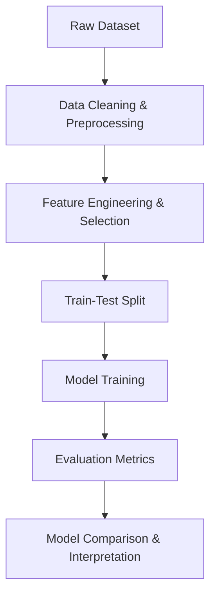

<!-- ✨ Colorful Header Banner -->
<p align="center">
  
  
  
  
  
</p>

<h1 align="center">💳 Credit Risk Modeling using Machine Learning</h1>

<p align="center">
  Predicting loan default probability using tree-based ML models with <b>high interpretability</b> and <b>recall optimization</b>.
</p>

<p align="center">
  🌐 <a href="https://cipherx-credit-risk-model.streamlit.app/">Live Demo App</a> |
  🧠 <a href="https://github.com/cipherX2433/Credit-risk-model">Source Code</a>
</p>

## 🧠 Overview

> **Goal:** Predict the likelihood of loan default using advanced ML techniques, focusing on recall for high-risk borrowers.

Financial institutions rely on accurate credit risk assessment to minimize loan losses and optimize decision-making.  
This project explores **data-driven modeling**, **class imbalance handling**, and **explainable AI** for credit scoring.

---

### 📊 Highlights

- 🏆 **Best Model:** XGBoost (AUC > 0.90)
- ⚖️ **SMOTE Oversampling:** +14% recall improvement
- 🔍 **Top Features:** Credit History, Loan-to-Income Ratio
- 🧩 **Focus Metrics:** Recall & AUC to minimize false negatives (missed defaulters)

---

## 🎯 Problem Statement

Traditional credit scoring systems are rule-based and may fail to capture nonlinear relationships in borrower data.  
Our machine learning approach enhances detection of risky borrowers while maintaining interpretability and fairness.

---

## 🧭 Objectives

✅ Build robust classifiers for binary credit risk classification  
✅ Perform detailed EDA and feature engineering  
✅ Handle class imbalance using **SMOTE** and hybrid sampling  
✅ Optimize for **AUC**, **Recall**, and **F1-score**  
✅ Enhance transparency with **feature importance** and **SHAP explanations**

---

## 🗂️ Dataset (High-Level)

| Category | Example Features |
|-----------|------------------|
| **Demographics** | Gender, Education, Dependents |
| **Financial** | Applicant Income, Loan Amount, Term |
| **Credit History** | Credit Score, Previous Loans |
| **Target** | Loan_Status / Default_Flag |

🧹 Data preprocessing includes **missing value imputation**, **categorical encoding**, and **feature scaling**.

---

## 🧩 Workflow



```
🔬 Modeling Techniques
Model	Type	Description
Logistic Regression	Baseline	Benchmark for interpretability
Random Forest	Ensemble	Handles feature interactions
XGBoost	Gradient Boosting	Best performer with AUC > 0.90

Sampling: SMOTE, RandomUnderSampler, CombinedSampler
Feature Selection: RFE + Tree-based importance
Validation: Stratified K-Fold Cross-validation
```

```
📊 Results Summary
Model	AUC	Recall	Precision	F1
Logistic Regression	0.83	0.72	0.70	0.71
Random Forest	0.88	0.78	0.75	0.76
🏆 XGBoost	0.91	0.82	0.77	0.79

⚡ SMOTE oversampling improved recall by +14%.
💡 Credit History and Loan-to-Income Ratio are top predictors.

🧰 Tech Stack
Component	Technology
Language	Python 3.11
Environment	Jupyter Notebook
ML Libraries	Scikit-learn, XGBoost
Data Analysis	Pandas, NumPy
Visualization	Matplotlib, Seaborn
Explainability	SHAP, LIME
```
# Clone repository
git clone https://github.com/cipherX2433/Credit-risk-model.git
cd Credit-risk-model

# Install dependencies
pip install -r requirements.txt

# Launch notebook
jupyter notebook Credit_Risk_Model.ipynb


